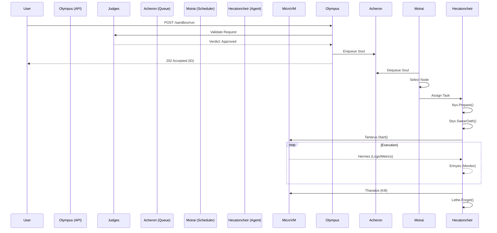
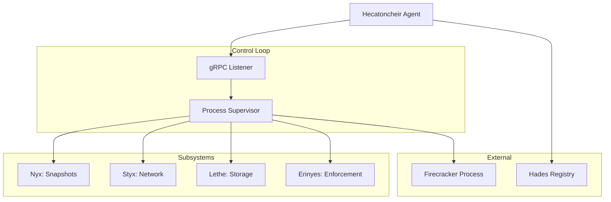

# The Blueprint: System Architecture

> *"The gates of Tartarus are of bronze, and round it runs a fence of bronze; and night is spread in triple line all about it like a neck-circlet."* — Hesiod

This document provides a technical deep dive into the architecture of Tartarus. While the [Mythology Guide](./mythology.md) explains the naming conventions, this document focuses on the engineering principles, data flows, and component interactions.

## System Design Principles

1. **Strict Isolation**: Every workload runs in its own Firecracker microVM. No shared kernel, no shared IPC.
2. **Ephemeral by Default**: Sandboxes are immutable and ephemeral. State is wiped on termination unless explicitly persisted.
3. **Policy as Code**: All admission and runtime constraints are defined in versioned policy files.
4. **Event-Driven**: Components communicate asynchronously via queues and streams where possible.

## The Journey of a Soul (Request Flow)

The lifecycle of a sandbox request ("Soul") follows a strict path through the system.

### 1. Ingress & Judgment (Olympus)

When a user submits a request to the API:

1. **Olympus** receives the HTTP/gRPC request.
2. **Cerberus** validates the authentication token.
3. **The Judges** convene to decide the request's fate:
   - **Minos** checks if the user has sufficient quota.
   - **Rhadamanthus** validates the request against active security policies.
   - **Aeacus** logs the request for audit purposes.
4. If approved, the request is stamped with a `Verdict` and pushed into **Acheron**.

### 2. Scheduling (The Fates)

The **Moirai** (Scheduler) watch the Acheron queue:

1. **Clotho** (The Spinner) pulls the request.
2. **Lachesis** (The Allotter) filters nodes based on constraints (CPU, memory, labels). She uses **Hades** (Registry) to find suitable candidates.
3. **Atropos** (The Inevitable) selects the best node (e.g., least loaded) and assigns the task.

### 3. Execution (Tartarus)

The assigned **Hecatoncheir** (Agent) on the worker node picks up the task:

1. **Nyx** prepares the root filesystem. She clones a snapshot (COW) from the base template.
2. **Styx** sets up the networking. A TAP device is created, and iptables rules are applied to enforce the `NetworkContract`.
3. **Tartarus** launches the Firecracker process, attaching the drive and network.
4. **Lethe** mounts the ephemeral overlay filesystem.

### 4. Runtime & Enforcement

While the sandbox runs:

1. **Hermes** streams logs and metrics from the microVM to the central collector.
2. **The Erinyes** (Furies) monitor the process:
   - **Alecto** watches the clock. If `MaxDuration` is exceeded, she signals termination.
   - **Tisiphone** watches cgroups. If memory usage spikes, she throttles or kills the VM.

### 5. Termination (Death)

When the task completes or is killed:

1. **Thanatos** handles the shutdown signal.
2. **Tartarus** stops the Firecracker process.
3. **Styx** tears down the network interface.
4. **Lethe** wipes the ephemeral overlay, ensuring no data remains.
5. **Cocytus** records the exit code and any error details.

## Visualizing the Flow



## Component Architecture

### The Hecatoncheir Agent

The agent is a monolithic daemon running on every worker node. It is responsible for the full lifecycle of microVMs on that host.



### Network Architecture (Styx)

Networking is achieved via a bridge interface on the host, with individual TAP devices for each microVM.

```
       Internet
          ▲
          │ (NAT)
    ┌─────┴─────┐
    │  eth0     │ Host Interface
    └─────┬─────┘
          │
    ┌─────┴─────┐
    │  br0      │ Tartarus Bridge (172.16.0.1/16)
    └─────┬─────┘
          │
    ┌─────┴─────┐
    │  veth123  │ TAP Device (172.16.0.2)
    └─────┬─────┘
          │
          ▼
     [ MicroVM ]
```

## Persistence & State

- **Hades Registry**: Redis (Ephemeral state, heartbeats)
- **Acheron Queue**: Redis Streams (Reliable queuing)
- **Erebus Storage**: S3-compatible Blob Store (Snapshots, Images)
- **Themis Policies**: Git/ConfigMap (Versioned configuration)

## Security Model

Tartarus assumes that **all user code is malicious**.

1. **Hypervisor Isolation**: KVM + Firecracker provides a hardware-virtualized boundary.
2. **Network Isolation**: Default-deny network policies. No access to host or other VMs.
3. **Resource Isolation**: Cgroups limit CPU and Memory usage.
4. **System Call Filtering**: Seccomp filters restrict what the guest kernel can do.
