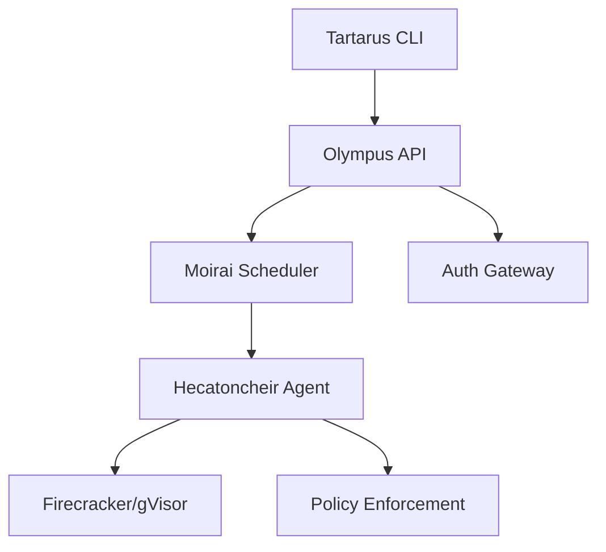

# Welcome to Tartarus

Tartarus is a high-performance, secure, and scalable microVM orchestration platform for running isolated workloads.

## Key Features

<div class="grid cards" markdown>

-   :fire: **MicroVM Sandboxing**

    ---
    Secure isolation using Firecracker and Cloud Hypervisor with sub-200ms cold starts.

-   :chart_with_upwards_trend: **Predictive Scaling**

    ---
    Persephone learns demand patterns and pre-warms nodes before traffic spikes.

-   :shield: **Security First**

    ---
    Hardened kernels, seccomp profiles, and RBAC via Cerberus authentication gateway.

-   :package: **Template Marketplace**

    ---
    Pre-built templates for Python, Node.js, Go, Rust, and more.

</div>

## Quick Start

```bash
# Install Tartarus CLI
curl -sL https://get.tartarus.io/install.sh | bash

# Run your first sandbox
tartarus run --template python-ds --name my-sandbox

# Check status
tartarus ps
```

## Architecture



## Next Steps

- [Getting Started Guide](getting-started.md) - Full installation and first sandbox
- [Creating Templates](tutorials/creating-templates.md) - Build custom sandbox templates
- [Plugin System](plugins/index.md) - Extend with custom judges and furies
- [API Reference](api/index.md) - REST API documentation
